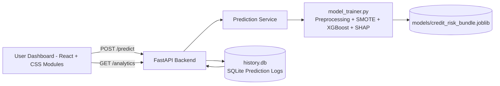

# CrediShield XAI

Production-grade **Credit Risk Assessment** platform with an Explainable AI core, MLOps logging, and an interactive What-If simulation dashboard.

## System Architecture

### End-to-end flow

1. User enters applicant profile in a multi-step form.
2. Frontend calls `POST /predict`.
3. Backend validates request with Pydantic.
4. ML engine computes Probability of Default (PD) and SHAP reason codes.
5. Backend logs input + output + timestamp to `history.db`.
6. Dashboard renders gauge + waterfall and enables live What-If simulation.
7. `GET /analytics` exposes historical trend aggregates for monitoring.

## Mathematical Foundations

### XGBoost (Intuition)

XGBoost is a gradient-boosted ensemble of decision trees that iteratively minimizes a differentiable loss (here, log-loss for binary default prediction), while regularizing complexity to avoid overfitting.

### SHAP Additive Explanation

Model output for an individual prediction can be explained as:

$$
f(x) = \phi_0 + \sum_{i=1}^{M} \phi_i
$$

Where:
- $\phi_0$ is the model baseline expectation.
- $\phi_i$ is the contribution of feature $i$ to move the prediction from baseline.

In this project, SHAP values are aggregated to business-level factors and surfaced as:
- Top 3 **risk-increasing** factors
- Top 3 **risk-decreasing** factors

## Feature Highlights

- German Credit dataset training pipeline (`model_trainer.py`)
- Categorical encoding + numerical scaling
- Class imbalance handling with **SMOTE**
- **XGBoost** classifier for PD prediction
- **SHAP** reason codes for local explainability
- FastAPI backend with:
  - `POST /predict`
  - `GET /analytics`
- MLOps-friendly SQLite logging (`history.db`) with timestamped prediction records
- React dashboard (Vite) with plain CSS Modules:
  - Multi-step assessment form
  - Gauge chart + SHAP waterfall chart
  - Live What-If simulator via slider-driven re-prediction

## Project Structure

- `model_trainer.py` – training + explanation engine
- `backend/` – FastAPI app (`api/`, `models/`, `services/`)
- `frontend/` – Vite React dashboard
- `requirements.txt` – Python dependencies
- `history.db` – runtime prediction history database (auto-created)

## Setup Instructions

### 1) Backend setup (Python)

1. Create and activate a virtual environment.
2. Install dependencies from `requirements.txt`.
3. Train the initial model artifact:
   - Run `model_trainer.py` once to generate `models/credit_risk_bundle.joblib`.
4. Start API server from repository root with Uvicorn, targeting `backend.main:app`.

### 2) Frontend setup (Node.js)

1. Enter `frontend/`.
2. Install dependencies.
3. Run the Vite dev server.
4. Ensure backend is running on `http://127.0.0.1:8000` (default configured in frontend API client).

### 3) API Keys / Secrets

No external API keys are required for the current baseline implementation.

## Analytics & Drift Readiness

`history.db` stores:
- request payload (`input_json`)
- PD score (`pd_score`)
- SHAP reason codes
- UTC timestamp

This data enables future drift analysis, stability monitoring, and retraining triggers.

## Future Roadmap

- Automated data drift and concept drift monitoring pipeline
- Scheduled retraining and model registry integration
- CI/CD with quality gates (tests + lint + security scans)
- Role-based access controls and audit hardening
- Containerization + deployment templates

## Suggested Production Hardening

- Add authentication and rate limiting for API endpoints
- Add request tracing + structured logs for observability
- Add integration tests for `/predict` and `/analytics`
- Add feature store for consistent train/serve feature definitions

## Troubleshooting

If the dashboard shows **"Failed to fetch"**, use this checklist:

1. **Backend process must be running**
  - Start Uvicorn on `http://127.0.0.1:8000`.
  - Verify by opening `http://127.0.0.1:8000/docs`.

2. **Frontend and backend port consistency**
  - Frontend default: `http://localhost:5173` (or `http://127.0.0.1:5173`).
  - Backend default: `http://127.0.0.1:8000`.
  - Frontend API client must call `http://127.0.0.1:8000/predict` explicitly.

3. **CORS origin alignment**
  - Backend CORS is configured for `http://localhost:5173` and `http://127.0.0.1:5173`.
  - If Vite runs on a different port, add that origin to `backend/main.py`.

4. **Inspect terminal/browser logs**
  - Backend logs request validation errors and prediction exceptions.
  - Frontend `fetch` catch blocks print exact request failure details in DevTools console.
