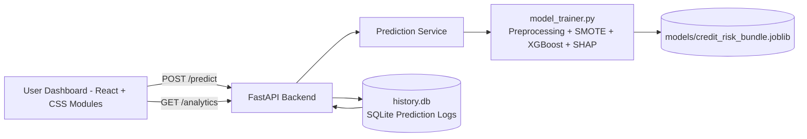

# CrediShield XAI

Production-grade **Credit Risk Assessment** platform with an Explainable AI core, MLOps logging, and an interactive What-If simulation dashboard.

## System Architecture

### End-to-end flow

1. User enters applicant profile in a multi-step form.
2. Frontend calls `POST /predict`.
3. Backend validates request with Pydantic.
4. ML engine computes Probability of Default (PD) and SHAP reason codes.
5. Backend logs input + output + timestamp to `history.db`.
6. Dashboard renders gauge + waterfall and enables live What-If simulation.
7. `GET /analytics` exposes historical trend aggregates for monitoring.

## Mathematical Foundations

### XGBoost (Intuition)

XGBoost is a gradient-boosted ensemble of decision trees that iteratively minimizes a differentiable loss (here, log-loss for binary default prediction), while regularizing complexity to avoid overfitting.

### SHAP Additive Explanation

Model output for an individual prediction can be explained as:

$$
f(x) = \phi_0 + \sum_{i=1}^{M} \phi_i
$$

Where:
- $\phi_0$ is the model baseline expectation.
- $\phi_i$ is the contribution of feature $i$ to move the prediction from baseline.

In this project, SHAP values are aggregated to business-level factors and surfaced as:
- Top 3 **risk-increasing** factors
- Top 3 **risk-decreasing** factors

## Feature Highlights

- German Credit dataset training pipeline (`model_trainer.py`)
- Categorical encoding + numerical scaling
- Class imbalance handling with **SMOTE**
- **XGBoost** classifier for PD prediction
- **SHAP** reason codes for local explainability
- FastAPI backend with:
  - `POST /predict`
  - `GET /analytics`
- MLOps-friendly SQLite logging (`history.db`) with timestamped prediction records
- React dashboard (Vite) with plain CSS Modules:
  - Multi-step assessment form
  - Gauge chart + SHAP waterfall chart
  - Live What-If simulator via slider-driven re-prediction

## Project Structure

- `model_trainer.py` – training + explanation engine
- `backend/` – FastAPI app (`api/`, `models/`, `services/`)
- `frontend/` – Vite React dashboard
- `requirements.txt` – Python dependencies
- `history.db` – runtime prediction history database (auto-created)

